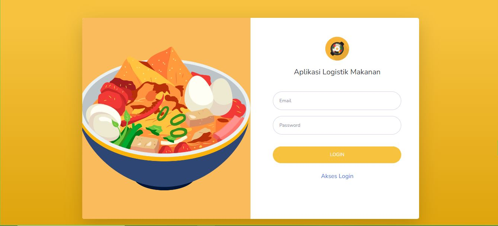
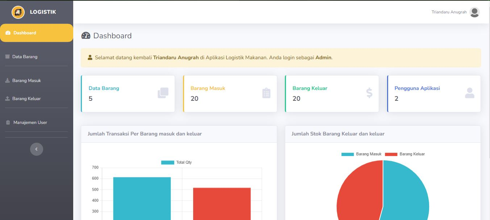
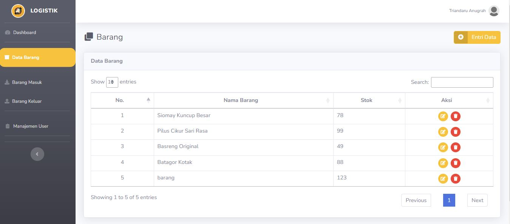

# Aplikasi Web Logistik

Selamat datang di aplikasi web Logistik! Aplikasi ini dirancang menggunakan laravel 10 dan php 8 dengan dua peran utama: Admin dan User.

- Admin (email: admin@example.com, password: password) 
- User (email: user@example.com, password: password)


## Fitur Utama

### Role Admin

-   **Dashboard**: Akses statistik lengkap seperti jumlah pengguna, jumlah data barang, , barang masuk, barang keluar, dan grafik.
-   **Manajemen Barang**: Tambah, lihat, edit, dan hapus data barang.
-   **Manajemen Barang Masuk**: Tambah, edit, dan hapus data barang masuk.
-   **Manajemen Barang Keluar**: Tambah, edit, dan hapus data Barang keluar.
-   **Manajemen Pengguna**: Tambah, edit, dan hapus data pengguna.

### Role User

-   **Dashboard**: Akses statistik lengkap seperti jumlah pengguna, jumlah data barang, , barang masuk, barang keluar, dan grafik.
-   **Manajemen Barang**: Tambah, lihat, edit, dan hapus data barang.
-   **Manajemen Barang Masuk**: Tambah, edit, dan hapus data barang masuk.
-   **Manajemen Barang Keluar**: Tambah, edit, dan hapus data Barang keluar.


## Screenshots

### Login



### Dashboard



### Barang



## Instalasi

Ikuti langkah-langkah di bawah ini untuk menginstal aplikasi ini:

1. Clone repository:

    ```bash
    git clone https://github.com/username/repository.git
    ```

2. Akses direktori proyek:

    ```bash
    cd repository
    ```

3. Install dependensi:

    ```bash
    composer install
    ```

4. Buat file `.env`:

    ```bash
    cp .env.example .env
    ```

5. Generate kunci aplikasi:

    ```bash
    php artisan key:generate
    ```

6. Jalankan migrasi database:

    ```bash
    php artisan migrate
    ```

7. Jalankan server:
    ```bash
    php artisan serve
    ```

## Kontribusi

Jika Anda ingin berkontribusi pada proyek ini, silakan fork repository ini, buat branch baru, dan buat pull request dengan deskripsi perubahan yang Anda buat. Terimakasih😊
